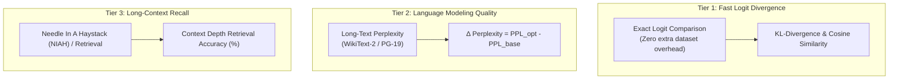

# Metrics and Co-Optimization Axes Framework

This document outlines the three co-optimization dimensions, the corresponding benchmark metrics, and the methodology for evaluating model quality degradation caused by structural KV-cache optimizations.

---

## 1. The Co-Optimization Framing

Existing KV-cache optimization techniques typically focus on a single dimension in isolation, frequently incurring hidden costs in other dimensions:
- **Offloading (e.g., FlexGen):** Optimizes memory capacity but incurs PCIe transfer latency and low throughput.
- **Prefix Caching (e.g., LMCache):** Optimizes prefill latency via reuse, but requires host RAM/storage management.
- **Eviction/Compression (e.g., H2O, FP8/INT4):** Minimizes memory footprint and memory bandwidth bottlenecks, but risks precision degradation and context loss.

Our benchmark formalizes these dimensions into three orthogonal axes defined in [`src/core/axis.py`](file:///home/khemi/workspace/llm_bench/src/core/axis.py):

| Axis | What it Controls | Examples | Primary Bottleneck Addressed |
|---|---|---|---|
| **`STRUCTURAL`** | **How** the KV-cache is represented or compressed | Quantization (FP8, INT4), Eviction (H2O, SnapKV), Sink+Window (StreamingLLM) | GPU HBM capacity & memory bandwidth |
| **`SPATIAL`** | **Where** the KV-cache lives in the hardware memory hierarchy | Host CPU RAM swapping, NVMe offload, tiered storage | Limited GPU VRAM on consumer GPUs (e.g., 6–16 GB) |
| **`TEMPORAL`** | **When** KV data moves, is reused, or is recomputed | Prefix caching, layer-wise prefetching, asynchronous pipelining | Prefill compute latency ($O(N^2)$) & PCIe sync stalls |

---

## 2. Core Metrics and Axis Correspondence

Every run records a standardized [`ResultEntry`](file:///home/khemi/workspace/llm_bench/src/core/metrics.py#L72-L103). The metrics map directly to the co-optimization axes:

| Metric | Field in `ResultEntry` | Corresponding Axis | Rationale & Trade-Off |
|---|---|---|---|
| **Peak VRAM** | `peak_alloc_mb`, `peak_reserved_mb` | `SPATIAL`, `STRUCTURAL` | Verifies whether the technique prevents Out-Of-Memory (OOM) on consumer GPUs as context scales. |
| **Host RAM Delta** | `host_rss_delta_mb` | `SPATIAL` | Offloading transfers memory pressure from VRAM to host DRAM. Measuring process RSS delta (after workload vs. before engine init) tracks the true system-level footprint. |
| **Time to First Token (TTFT)** | `ttft_sec`, `cold_ttft_sec`, `ttft_p95_sec` | `TEMPORAL` | Measures prefill latency. Reports cold vs. warm delta and P95 TTFT under 10–15 concurrent simulated users. |
| **Throughput & Inter-Token Latency (TPOT)** | `throughput_tok_per_sec`, `tpot_mean_ms`, `tpot_p95_ms` | `STRUCTURAL`, `SPATIAL` | Autoregressive decoding is memory-bandwidth bound. Measures token generation speed and detects decode stalls/jitter. |
| **PCIe Transfer Volume & Bandwidth** | `memcpy_bytes_per_token`, `memcpy_htod_bytes`, `memcpy_peak_bw_gbs` (via `--profile`) | `SPATIAL`, `TEMPORAL` | Measures normalized PCIe bus utilization and transfer volume per generated token. |
| **Logit Divergence Fidelity** | `extra["top1_agreement"]`, `extra["kl_div_mean"]`, `extra["kl_div_p99"]` | `STRUCTURAL` | Compares compressed/offloaded token probability distributions against FP16 baseline. |
| **Long-Term Memory Adherence** | `extra["longmem_acc_overall"]`, `extra["longmem_acc_<task>"]` | `STRUCTURAL` | Evaluates task-level retention on LongMemEval across 5 core capabilities. |

---

## 3. Deep Dive: Quality Measurement in the `STRUCTURAL` Axis

### Why Quality Belongs Exclusively to the `STRUCTURAL` Axis

In standard serving systems:
- **`SPATIAL` offloading** is mathematically lossless ($Q_{\text{err}} = 0$). Moving full-precision FP16 tensors to CPU RAM and restoring them to VRAM produces bit-identical logits to a purely in-VRAM execution.
- **`TEMPORAL` prefix reuse** is mathematically lossless ($Q_{\text{err}} = 0$). Reusing an identical prefix KV state bypasses recomputation without numerical distortion.
- **`STRUCTURAL` modifications** alter the tensor precision, shape, or token set:
  1. **Quantization (e.g., FP8, INT4, KIVI):** Truncates numerical precision, introducing quantization noise into attention scores and values.
  2. **Token Eviction / Pruning (e.g., H2O, SnapKV):** Selectively drops past tokens deemed "unimportant," risking the loss of needle facts or long-range dependencies.
  3. **Window Attention (e.g., StreamingLLM):** Retains only attention sinks and recent local tokens, sacrificing middle-context visibility.

Therefore, **the `STRUCTURAL` axis uniquely introduces an accuracy vs. efficiency trade-off.**

### Evaluation Strategies for Structural Techniques

To rigorously evaluate structural techniques without introducing prohibitive evaluation overhead, we adopt three tiers of quality metrics:



#### 1. Tier 1: Logit Divergence (Fast Sanity Check)
* **Goal:** Immediate detection of precision collapse or numerical instability during standard test sweeps.
* **Method:** Run identical prompts through the baseline (uncompressed FP16) and the structural technique. Compare output logit distributions over the first $N$ decoded tokens:
  $$\text{CosineSimilarity}(L_{\text{baseline}}, L_{\text{structural}})$$
  $$\text{KL}(P_{\text{baseline}} \parallel P_{\text{structural}})$$
* **Advantage:** Requires no external benchmark datasets; computed directly within [`Technique.extra_metrics()`](file:///home/khemi/workspace/llm_bench/src/core/technique.py#L44-L47).

#### 2. Tier 2: Token-Level Perplexity ($\Delta \text{PPL}$)
* **Goal:** Measure general autoregressive language modeling fidelity across extended context lengths.
* **Method:** Measure sliding-window negative log-likelihood on a standardized long-text benchmark (e.g., WikiText-2, PG-19, or synthetic long text).
* **Metric:**
  $$\Delta \text{PPL} = \text{PPL}_{\text{structural}} - \text{PPL}_{\text{baseline}}$$
* **Thresholds:**
  - $\Delta \text{PPL} < 0.1$: Imperceptible degradation (acceptable for production FP8/INT8).
  - $0.1 \le \Delta \text{PPL} \le 0.5$: Minor loss (acceptable for constrained consumer GPUs).
  - $\Delta \text{PPL} > 0.5$: Significant degradation; requires adjusting eviction ratio or quantization scale.

#### 3. Tier 3: Long-Context Retrieval / Needle In A Haystack (NIAH)
* **Goal:** Detect context blindness caused by token eviction policies (e.g., H2O, StreamingLLM).
* **Method:** Insert specific factual key-value pairs ("needles") at variable depths (0%, 25%, 50%, 75%, 100%) within long filler text ("haystack").
* **Metric:** Retrieval accuracy (%) across prompt lengths and depth bins.
* **Rationale:** Token eviction policies can maintain low overall perplexity on repetitive text while accidentally discarding critical, sparsely attended facts. NIAH directly exposes this failure mode.

---

## 4. Integration into the Benchmark Pipeline

Structural techniques record their quality metrics via the existing extensible schema:

1. **Workload Selection:** Standard latency/memory tests continue using [`SyntheticFiller`](file:///home/khemi/workspace/llm_bench/src/core/workload.py#L30-L58). A dedicated quality workload (e.g., `PerplexityWorkload` or `NeedleWorkload`) is provided for quality evaluation runs.
2. **Result Storage:** Metrics flow into `ResultEntry.extra`:
   ```json
   {
     "requested_ctx": 4096,
     "status": "SUCCESS",
     "axes": ["STRUCTURAL"],
     "peak_alloc_mb": 3450.0,
     "throughput_tok_per_sec": 52.4,
     "extra": {
       "ppl_baseline": 8.42,
       "ppl_compressed": 8.48,
       "ppl_delta": 0.06,
       "niah_retrieval_acc": 0.98
     }
   }
   ```
3. **Cross-Axis Analysis:** Plots can directly correlate memory/latency gains against quality loss (e.g., *VRAM reduction vs. $\Delta \text{PPL}$* Pareto curves).
